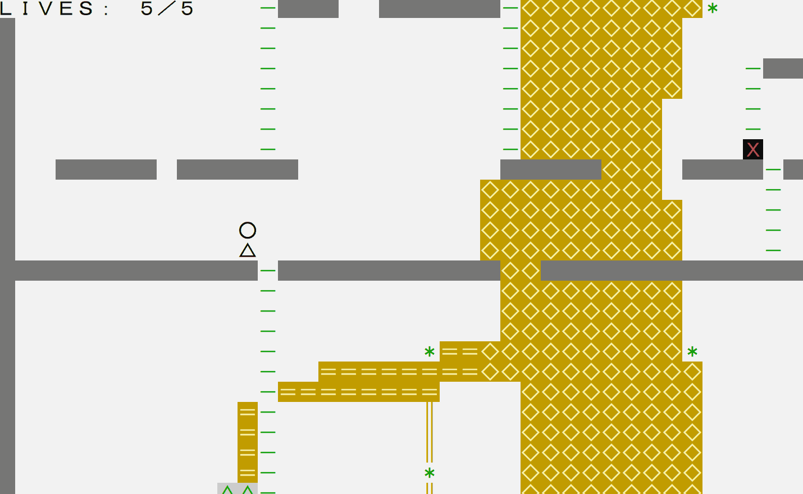
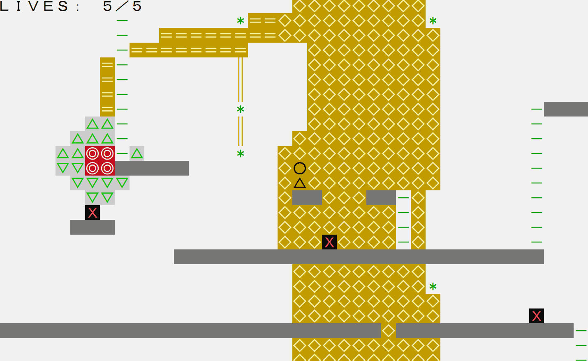
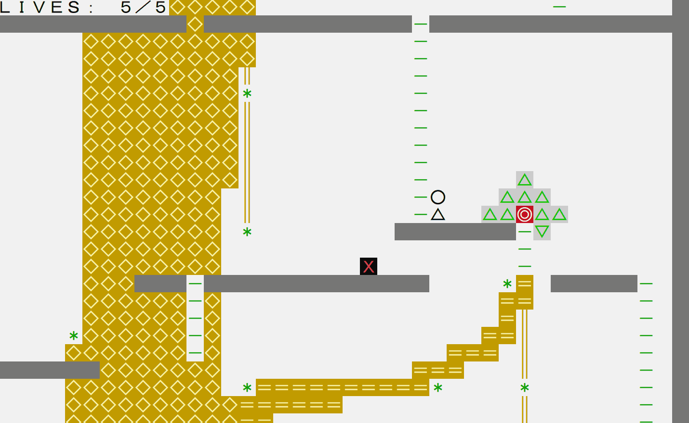

# 扶桑 / FUSOU

東アジアの神話に登場する「扶桑神樹」（ふそうしんじゅ）をモチーフにした Windows コンソールゲームです。
「光」を使って隠された床やはしごを見つけ、敵を避けながら各エリアのゴールを灯し、扶桑の頂を目指します。

---

## Gameplay

ゲーム全体の流れを以下のプレイ動画で確認できます。

### 光で隠された道を見つける



光を使うことで、隠された床やはしごを発見できます。

### 敵を避けながら進む



探索中は敵を避けながら、先へ進みます。

### ゴールを灯す



各エリアのゴールを灯すことで進行し、扶桑神樹の頂点を目指します。

https://github.com/user-attachments/assets/ec38597b-5686-4e94-af06-4f7eb1881620

---

## 制作中に見つけた課題

本作は、私にとって初めて制作したコンソールゲームです。開発当初は `std::cout` を使い、画面に表示する内容をコード内に直接書いていました。
しかし、制作を始めてすぐに、この方法ではマップが大きくなるほど変更や調整が難しくなり、継続して制作するには適していないと考えました。

以前の仕事経験で Chart.js を使ってデータを可視化した経験から、マップ制作にも可視化ツールを用意し、JSON を介したデータ駆動（Data-driven）の仕組みにすることを考えました。

そこで、FUSOU のシーン制作に特化したツール「FusouMapForge」を制作しました。

---

## FusouMapForge

https://github.com/user-attachments/assets/e9f937e9-19d0-41e6-a1a5-d469582843ce

コードを書き換えずにマップを編集でき、保存後はゲームを再起動するだけで変更を確認できるようになりました。マップ調整の反復が容易になり、レベルデザインの試行錯誤に集中できるようになりました。

---

## Data Pipeline

### シーンデータ

FusouMapForge で編集したシーンは JSON として保存し、ゲーム側で読み込んで実行時のマップデータへ変換します。

```text
FusouMapForge → Scene JSON → MapJsonLoader → TileMap → Game Runtime
```

### タイル定義

タイルの定義は `TilePalette.json` にまとめ、スクリプトからゲーム側で使用する C++ ヘッダーと、FusouMapForge 側で使用する JavaScript データを自動生成しています。

```text
TilePalette.json
  → GenerateTilePalette.ps1
    → C++ Header → Game Runtime
    → JavaScript → FusouMapForge
```

同じ定義を複数箇所で手作業で管理せず、ゲームと制作ツールのデータを一致させる仕組みにしました。

---

## Console Rendering Pipeline

Console 画面の一部しか変化していない場合でも、毎フレーム画面全体を出力し直すのは無駄が多いと考えました。
そこで、1 フレーム分の表示内容をいったん CellBuffer として構成し、前回のフレームとの差分だけを Console に反映する方式を採用しました。

### CellBuffer

ゲームの状態から、文字・前景色・背景色を持つ `Cell` を組み合わせて 1 フレーム分の `CellBuffer` を生成します。

この段階では「何を表示するか」の構成に集中しています。

### 差分描画

生成したフレームを前回の `CellBuffer` と比較し、変更されていない Cell は出力をスキップします。

変更された部分については、同じ表示スタイルが続く Cell をまとめて Console へ出力します。

### Console への出力

最後に、文字位置や前景色・背景色を合わせて出力します。

---

## その他のポイント

### Fixed-step Simulation

ゲーム中の更新処理は、描画フレームとは分離した固定時間刻みで進めています。

描画間隔が変化しても、ゲーム内の移動や判定を一定の時間単位で処理できるようにしました。

### Platform Dependency

開発初期は、学校から提供されたライブラリの API をゲーム側から直接利用していました。
しかし、内部の動作を自分で管理できない外部ライブラリへの依存がゲーム全体に広がることや、将来 GitHub で公開する際にそのライブラリをそのまま配布できない可能性を考え、依存のさせ方を見直す必要があると判断しました。

これまでのソフトウェア開発経験から、外部 API を各所から直接呼び出すのではなく、自分のプログラムとの境界を明確にする方針を考えました。具体的な構成については AI の提案も参考にし、外部ライブラリへの依存を限定した設計へ変更しました。

---

## Build from Source

本プロジェクトは Windows x64 / MSVC / C++20 を前提とし、CMake 3.20 以上でビルドします。

PowerShell または pwsh と、CMake で利用可能なビルドジェネレーターが必要です。

### Dev

```powershell
cmake -S . -B out\build\dev -G Ninja -DCMAKE_BUILD_TYPE=Debug -DFUSOU_STAGE=Dev
cmake --build out\build\dev
```

### Shipping

```powershell
cmake -S . -B out\build\shipping -G Ninja -DCMAKE_BUILD_TYPE=Release -DFUSOU_STAGE=Shipping
cmake --build out\build\shipping
```

---

## AI について

本作では、設計の検討や実装、リファクタリングに生成 AI を活用しています。
実現したい仕様や課題を整理した上で提案を参考にし、採用する方針やゲームへの組み込み方を判断しながら開発しました。

---

## License

本リポジトリ内のオリジナルのソースコード、ゲームデータ、ドキュメント、およびツールは、ポートフォリオとしての閲覧を目的に公開しています。再利用、改変、再配布は許可していません。

`third_party/` 以下のライブラリには、それぞれのライセンスが適用されます。詳細は [THIRD_PARTY_NOTICES.md](THIRD_PARTY_NOTICES.md) を参照してください。
